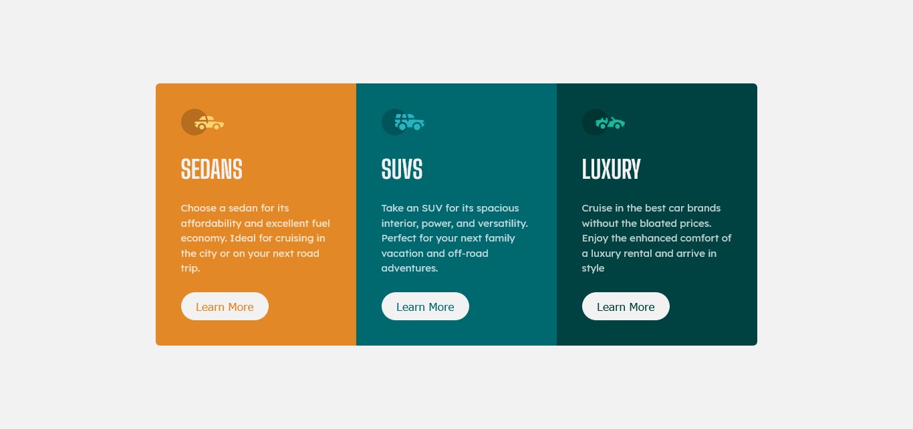
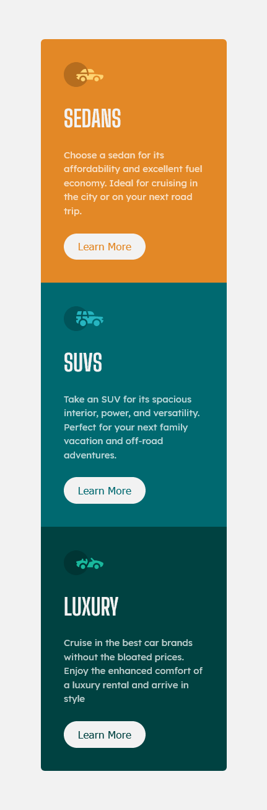

# Frontend Mentor - 3-column preview card component solution

This is a solution to the [3-column preview card component challenge on Frontend Mentor](https://www.frontendmentor.io/challenges/3column-preview-card-component-pH92eAR2-). Frontend Mentor challenges help you improve your coding skills by building realistic projects.

-   [Overview](#overview)
    -   [The challenge](#the-challenge)
    -   [Screenshot](#screenshot)
    -   [Links](#links)
-   [My process](#my-process)
    -   [Built with](#built-with)
-   [Me](#Me)

## Overview

### The challenge

Users should be able to:

-   View the optimal layout depending on their device's screen size
-   See hover states for interactive elements

### Screenshot

### links

-   Solution URL: [Add solution URL here](https://www.frontendmentor.io/solutions/3-responsive-column-card-component-GeNaFSZk7)
-   Live Site URL: [Add live site URL here](https://fem-projects.netlify.app/3-column-preview-card-component-main/)

## My process

### Built with

-   Semantic HTML5 markup
-   pure CSS custom properties
-   Flexbox
-   Mobile-first workflow

## Me

-   Frontend Mentor - [@CMarghin](https://www.frontendmentor.io/profile/CH4R4F)
-   Twitter - [@CMarghin](https://www.twitter.com/CMarghin)
