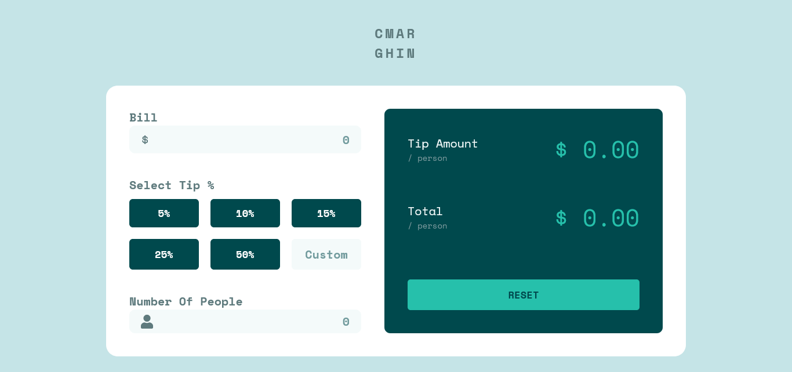
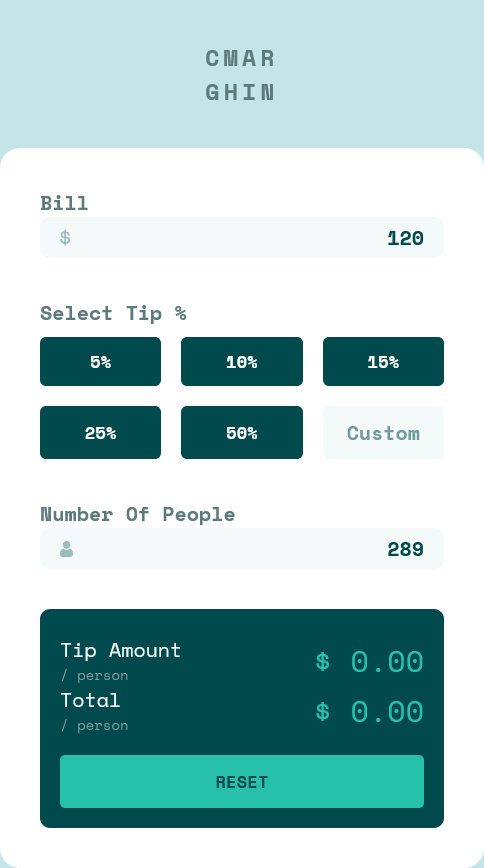

# Frontend Mentor - Tip calculator app solution

This is a solution to the [Tip calculator app challenge on Frontend Mentor](https://www.frontendmentor.io/challenges/tip-calculator-app-ugJNGbJUX). Frontend Mentor challenges help you improve your coding skills by building realistic projects.

## Table of contents

- [Overview](#overview)
  - [The challenge](#the-challenge)
  - [Screenshot](#screenshot)
  - [Links](#links)
- [My process](#my-process)
  - [Built with](#built-with)
  - [Continued development](#continued-development)
- [Me](#Me)

## Overview

### The challenge

Users should be able to:

- View the optimal layout for the app depending on their device's screen size
- See hover states for all interactive elements on the page
- Calculate the correct tip and total cost of the bill per person

### Screenshot

### Links
- challenge URL: [Frontend mentor](https://www.frontendmentor.io/challenges/tip-calculator-app-ugJNGbJUX)
- Solution URL: [Add solution URL here](https://your-solution-url.com)
- Live Site URL: [Add live site URL here](https://your-live-site-url.com)

## My process

### Built with

- Semantic HTML5 markup
- pure CSS custom properties
- Flexbox
- Mobile-first workflow
- Vanilla Js (practicing)

### Continued development

I think I need to learn more about layouts, maybe learn grid systeme
***everything is flexbox***, that what I wanted to avoid during the process of this project but I think I failed.
I need to develope my DOM skill, actually I didn't learn it I just Use the help of Emmet on Vscode and trying to make some sense .
I have to learn a framwork or a library. maybe!

## Me

- Frontend Mentor - [@CMarghin](https://www.frontendmentor.io/profile/CH4R4F)
- Twitter - [@CMarghin](https://www.twitter.com/CMarghin)
